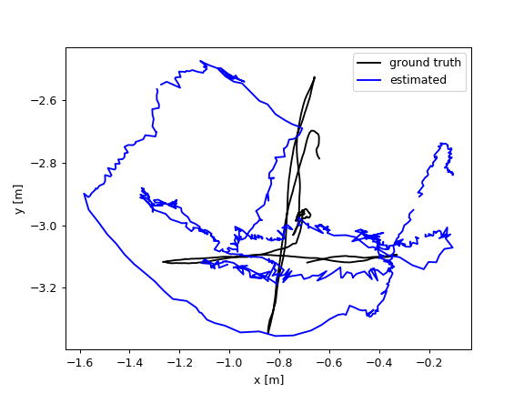
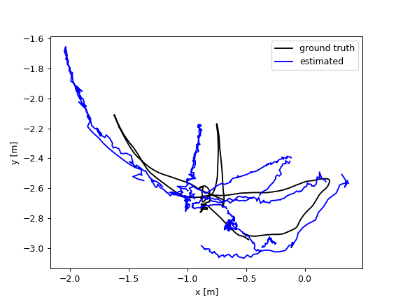
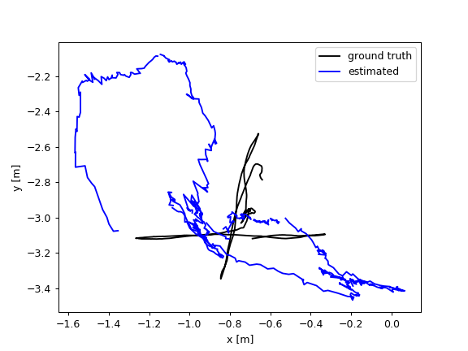
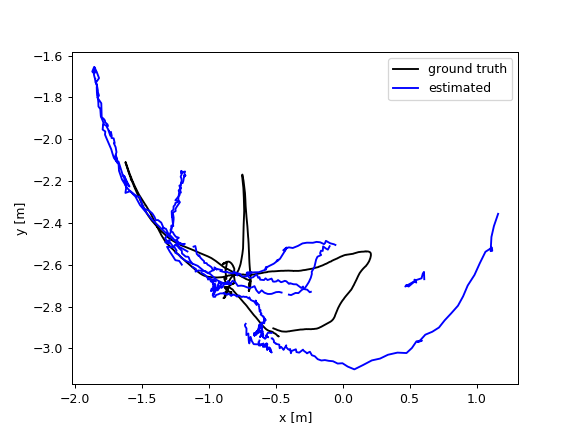

## What it is

This a reimplementation of the paper: [Detect-SLAM Making Object Detection and
SLAM Mutually Beneficial](https://ieeexplore.ieee.org/document/8354219).

## How it works

 We have only reimplemented the "moving object removal" part due the time
 constraints. 
 
 We use [Yolo3](http://github.com/cszhuhanlin/slam) pretrained on the dataset [VOC](http://host.robots.ox.ac.uk/pascal/VOC/) and [COCO](http://cocodataset.org/) to detect the moving person on each frame(image) from dataset **fr3/walking_xyz** and **fr3/walking_halfsphere** on [TUM](https://vision.in.tum.de/data/datasets/rgbd-dataset) webpage.

We modified the tracking thread of [ORB-SLAM 2](https://github.com/raulmur/ORB_SLAM2) to do **Moving Probability Updating** and **Moving Probability Propagation**. And then move the feature points of moving object before pose estimation.

## What we got

We did experiments on **fr3/walking_xyz** and **fr3/walking_halfsphere**. Below
are the estimated trajectory.

For comparasion, below are the results of original Orb-SLAM 2.

